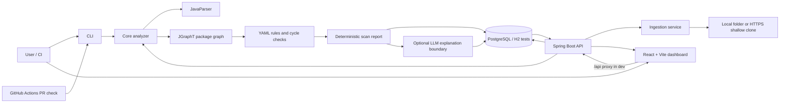

# ArchGuard

ArchGuard is a static architecture and technical-debt analysis tool for inherited Java codebases. It finds package coupling that has drifted from the intended design, detects cycles, estimates the blast radius of each violation, and presents the results as a CLI report, REST API, and React dashboard.

ArchGuard never compiles or executes the code under analysis. Deterministic code produces every architecture fact; the optional LLM only explains persisted facts in plain English.

## Problem

Legacy systems often have architecture rules that exist only in documents or in the memories of previous teams. Over time, controllers depend directly on repositories, packages become cyclic, and a small change can affect an unknown portion of the system. ArchGuard makes that drift measurable without requiring the target project to build.

## Features

- Parse Java packages and regular, wildcard, and static imports.
- Build a package dependency graph without executing analyzed code.
- Check YAML layer and forbidden-edge rules.
- Detect cycles using strongly connected components.
- Calculate reverse-reachability blast radius.
- Scan local folders or HTTPS Git repositories with bounded ingestion.
- Persist scans, graph facts, violations, commit SHAs, and repository history.
- Generate bounded LLM explanations with deterministic fallbacks and caching.
- Calculate a deterministic health score and render a repository trend.
- Explore the graph, layers, violations, explanations, and blast radius in React.
- Run the same core analysis from the CLI and from GitHub Actions pull-request checks.

## Architecture



## Stack and why

| Technology | Why it is used |
|---|---|
| Java 17 | Stable language/runtime baseline for the analyzer and API. |
| Maven modules | Keeps the plain-Java core independent from Spring. |
| JavaParser | Reads Java syntax without compiling or executing the target project. |
| JGraphT | Provides graph structures and SCC algorithms instead of custom graph code. |
| Jackson YAML | Loads human-readable architecture rules. |
| Spring Boot | Provides REST, validation, persistence integration, and background orchestration. |
| PostgreSQL | Durable scan history and graph/violation facts in deployments. |
| H2 | Fast isolated database tests. |
| JGit | Performs bounded shallow HTTPS repository ingestion. |
| React + Vite | Small independently deployable dashboard with fast development feedback. |
| Cytoscape.js | Renders unknown package graphs and supports selection/highlighting. |
| Docker Compose | Runs PostgreSQL, API, and the production-like web container locally. |

## Quickstart

### Requirements

- Java 17+
- Maven 3.9+
- Node.js 22+ and npm
- PostgreSQL for API development, or Docker Desktop for the full stack

### Build and test

```powershell
mvn verify
cd frontend
npm ci
npm test
npm run build
```

### Run the CLI

```powershell
mvn -pl cli -am install -DskipTests
mvn -pl cli exec:java "-Dexec.args=scan sample-project --rules sample-rules/archguard-rules.yml"
```

Exit codes are `0` for no violations, `1` for invalid input or execution errors, and `2` when violations are found.

### Run the development dashboard

Start PostgreSQL and the API in one terminal:

```powershell
docker compose -f docker-compose.dev.yml up -d
$env:SPRING_PROFILES_ACTIVE = "dev"
mvn -pl api -am spring-boot:run
```

Start Vite in another terminal:

```powershell
cd frontend
npm ci
npm run dev
```

Open `http://localhost:5173`. Vite proxies `/api` to the Spring API at `http://localhost:8080`.

### Run the Docker stack

```powershell
docker compose up --build
```

The Compose file has safe local defaults for PostgreSQL and the web port, so copying `.env.example` is optional for a first run. Copy it when you want to change the password, port, or LLM settings:

```powershell
Copy-Item .env.example .env
docker compose up --build
```

Open `http://localhost:8080`. In this mode nginx serves the built dashboard and proxies `/api` to the API container. Flyway creates the database schema automatically when the API starts.

## Configuration

| Variable | Purpose |
|---|---|
| `ARCHGUARD_DB_URL` | JDBC database URL. |
| `ARCHGUARD_DB_USERNAME` | Database username. |
| `ARCHGUARD_DB_PASSWORD` | Database password. |
| `ARCHGUARD_LOCAL_SCAN_ENABLED` | Explicitly enables local-folder API scans. |
| `ARCHGUARD_MAX_CLONE_BYTES` | Maximum remote clone size. |
| `ARCHGUARD_CLONE_TIMEOUT` | JGit transport timeout. |
| `ARCHGUARD_SCAN_*` | Bounded scan executor settings. |
| `VITE_SCAN_QUEUE_POLL_INTERVAL_MS` | Dashboard queue refresh interval in milliseconds (default `5000`). |
| `VITE_SCAN_STUCK_THRESHOLD_MS` | Active-scan age before the dashboard highlights it (default `120000`). |
| `LLM_API_KEY` | Optional Groq-compatible API key. |
| `ARCHGUARD_LLM_MODEL` | Optional LLM model name. |
| `ARCHGUARD_LLM_BLAST_RADIUS_LIMIT` | Maximum blast-radius packages in prompts. |
| `ARCHGUARD_LLM_SNIPPET_LINE_LIMIT` | Maximum import lines in prompts. |
| `ARCHGUARD_LLM_VIOLATIONS_PER_SCAN_LIMIT` | Maximum explanations per scan. |

Copy [.env.example](./.env.example) for the Docker defaults. Secrets must come from environment variables and must not be committed.

## Rules format

```yaml
layers:
  - name: web
    packagePatterns:
      - com.example.web
  - name: application
    packagePatterns:
      - com.example.app
  - name: repository
    packagePatterns:
      - com.example.data
forbidden:
  - from: web
    to: repository
noCycles: true
```

The first matching layer wins. Unmatched packages are `unknown`. `noCycles: true` reports strongly connected components with more than one package.

Cycle detection always runs, even when no rules YAML is supplied. Layer and forbidden-edge rules are optional; omit them when you only want the default cycle check.

## API workflow

```text
POST /api/scans
  -> QUEUED scan persisted
  -> background worker validates/ingests source
  -> core parses, graphs, checks rules, detects cycles, calculates blast radius
  -> deterministic facts persisted
  -> optional explanations cached or replaced with fallback text
  -> scan becomes COMPLETED or FAILED

GET /api/scans/{id}
GET /api/scans?status=RUNNING&page=0&size=50
GET /api/scans/queue-status
GET /api/scans/{id}/graph
GET /api/scans/{id}/violations
GET /api/repos/{repositoryId}/history
```

The scan list returns `ScanResponse` items ordered newest first; `status` is optional and `page` is zero-based. Queue status combines live executor measurements with queued/running database counts. On API startup, orphaned `QUEUED` and `RUNNING` scans are marked `FAILED` with an interruption message; they are not retried because analysis persistence is not yet restart-idempotent.

## Dashboard screenshots

Add measured screenshots here after a browser smoke test:

```text


```

The paths are placeholders and are intentionally not committed until real screenshots are captured.

In the dependency graph, double-click to zoom in around the pointer. Hold `Shift` while double-clicking to zoom out. Zoom is bounded to keep the graph usable.

LLM explanations are configured with `LLM_API_KEY`, `ARCHGUARD_LLM_MODEL`, `ARCHGUARD_LLM_MAX_TOKENS` (default `1500`), and `ARCHGUARD_LLM_DELAY_BETWEEN_CALLS_MS` (default `400`). Provider explanations are cached; fallback explanations are intentionally not cached so transient failures can be retried on a later scan.

## Limitations

- The analyzer is Java/package based; it does not model runtime calls, reflection, generated sources, or dependency-injection wiring.
- Parse failures are reported and skipped rather than repaired.
- The health score is intentionally simple: ten points per persisted violation, floored at zero.
- The LLM is optional and can only explain bounded deterministic facts.
- The dashboard currently requires the API to be available; it does not provide offline results.
- Docker Compose is a local/production-like stack, not a complete production deployment with TLS, backups, monitoring, or secret management.
- No performance benchmark numbers are claimed until real repositories are measured.

## Roadmap

- [x] Phase 0 — skeleton, README, and CI
- [x] Phase 1 — parser, graph, cycles, and CLI
- [x] Phase 2 — YAML rules and blast radius
- [x] Phase 3 — REST API, JGit, and PostgreSQL
- [x] Phase 4 — LLM explanations
- [x] Phase 5 — React dashboard
- [x] Phase 6 — health score and trend
- [x] Phase 7 — Docker and pull-request checks
- [ ] Production deployment, TLS, backups, monitoring, and measured performance study

## Documentation

- [docs/architecture.md](./docs/architecture.md) — current component architecture
- [docs/design-decisions.md](./docs/design-decisions.md) — ADR-style design record
- [docs/real-world-results.md](./docs/real-world-results.md) — reproducible repository study
- [docs/resume.md](./docs/resume.md) — resume bullets and project pitch
- [docs/interview-questions.md](./docs/interview-questions.md) — codebase-grounded interview preparation
- [docs/demo-script.md](./docs/demo-script.md) — short demo walkthrough
