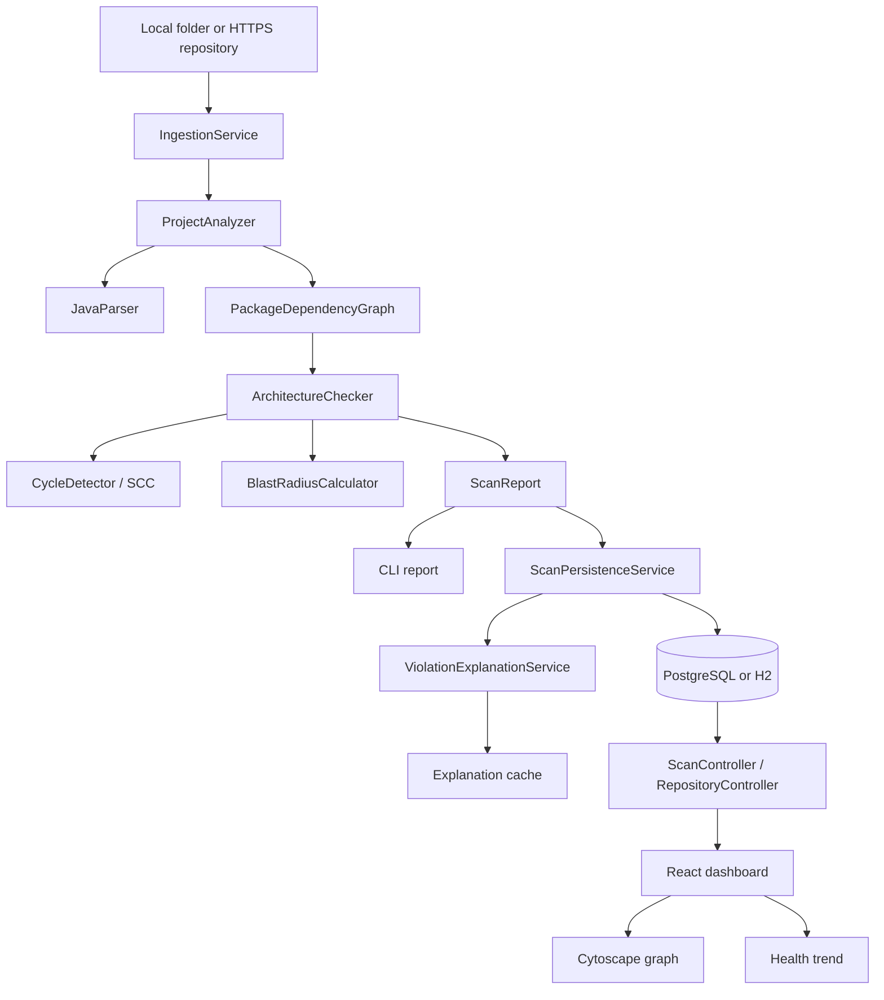

# Current architecture

ArchGuard has one deterministic analysis core and three entry paths: the CLI, the REST API, and the pull-request workflow.

## Boundaries

- `core` is plain Java and owns parsing, graph construction, rules, cycles, and blast radius.
- `cli` is a thin argument parser and report formatter around `core`.
- `api` owns ingestion, queueing, persistence, read models, explanations, and HTTP boundaries.
- `frontend` owns interaction and visualization only; it does not calculate architecture facts.
- The LLM receives bounded facts after deterministic analysis and cannot create or remove violations.

## Request lifecycle

1. A CLI user, dashboard user, or pull-request workflow submits a path/repository.
2. The API validates the request and persists a `QUEUED` scan before scheduling work.
3. The worker marks the scan `RUNNING`, obtains a local folder or bounded shallow clone, and invokes `ProjectAnalyzer`.
4. The report is persisted atomically as modules, dependencies, violations, and affected modules.
5. Explanations are generated or loaded from cache without changing the deterministic result.
6. The scan becomes `COMPLETED`; failed work becomes `FAILED` with a bounded message.
7. The dashboard polls status, then loads graph, violations, and repository history.
